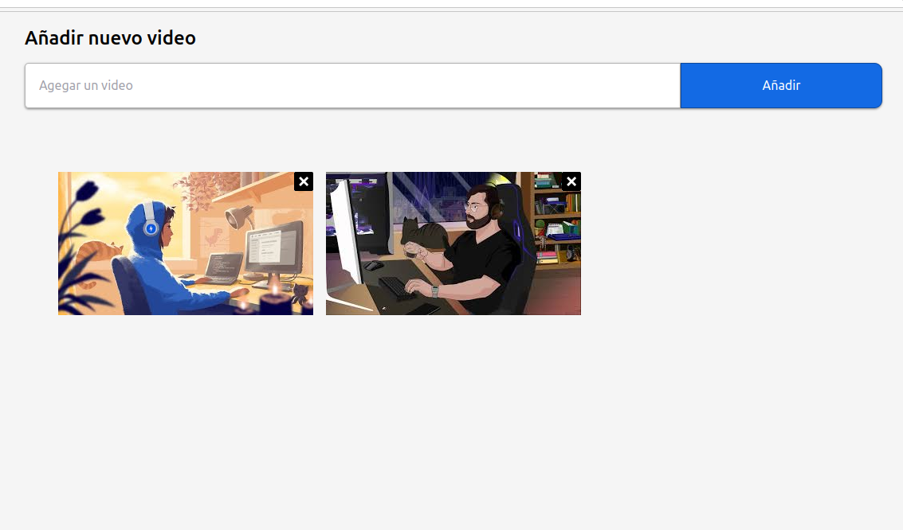

# youtube-list

## Project setup
```
npm install
```

### Compiles and hot-reloads for development
```
npm run serve
```

### Compiles and minifies for production
```
npm run build
```

### Lints and fixes files
```
npm run lint
```

### Se creea tabla en DynamoDb con index id tipo string para que tomar los id de youtube


### Se crearon tres funciones en Lambda que se encargan de listar, agregar y eliminar


### Vista sin listado


### Vista con listado


### Vista modal


### Vista video para reproducir


